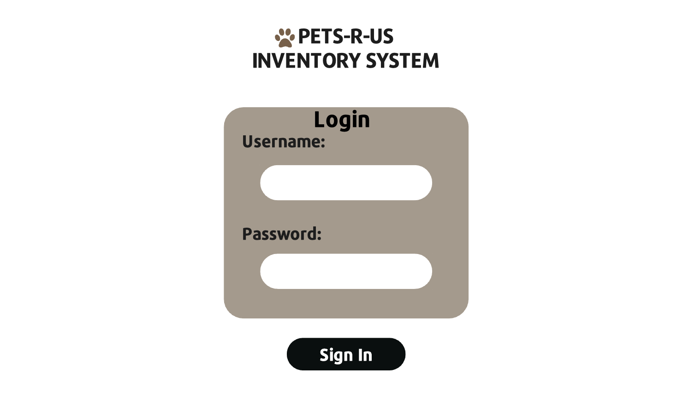
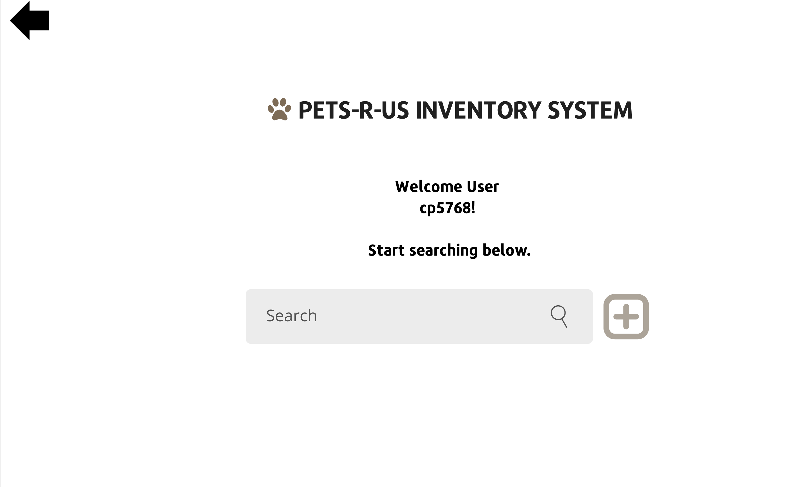
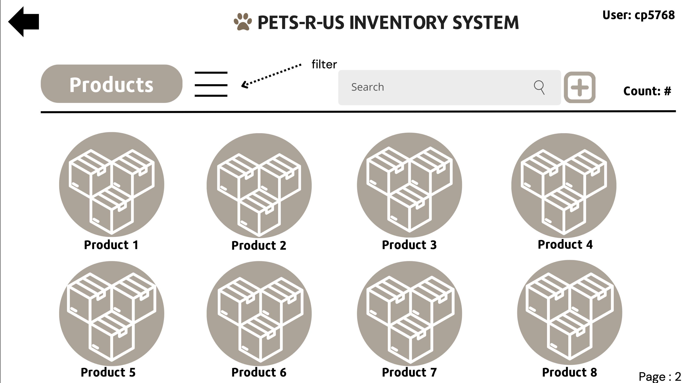
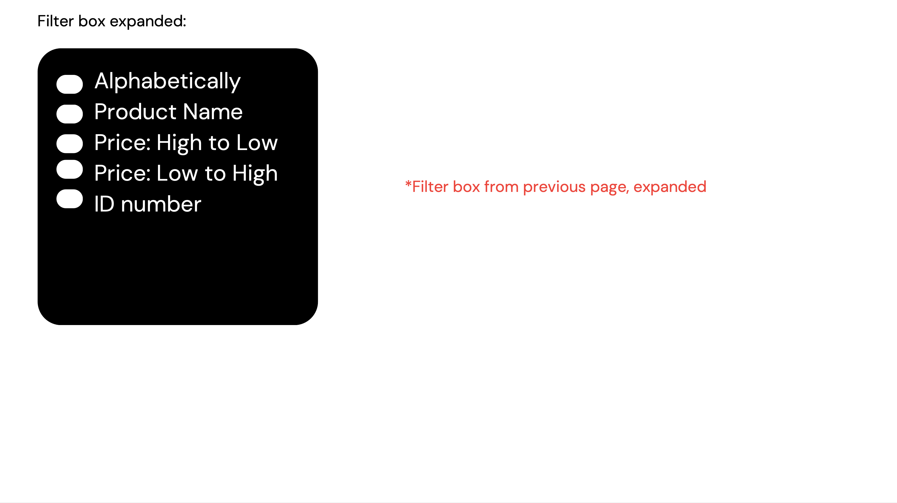
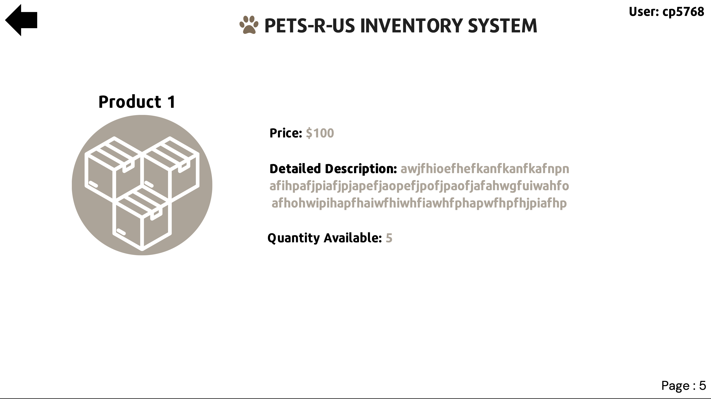
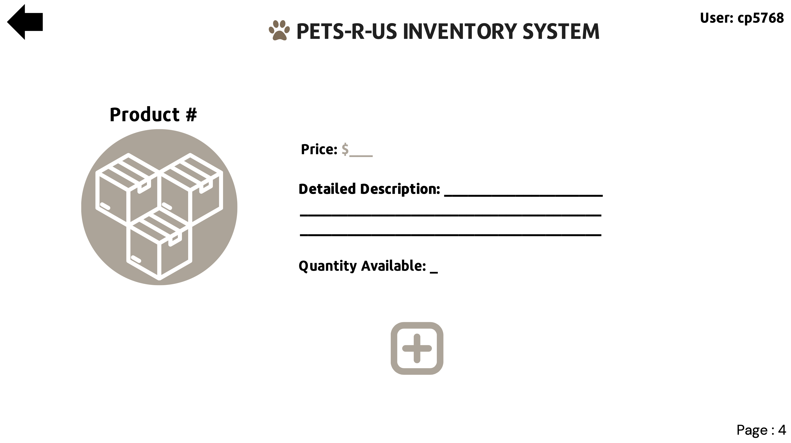

## Page 1: Login Screen
- **Description**: This page helps users to login in to the system using their custom login information in order to keep track of who is updating inventory and when.      

- **Parameters needed**: This page needs text of varying sizes and a box with username and password fields that are typeable and can lead to a separate login success page.
- **Data needed to render page**: database of login information, links
- **Link destinations for the page**: link to next page after the login screen which is a welcome and search page

TESTS:
1. Test that the input fields for username and password are present and that valid credentials go through.
2. Test the input field for invalid credentials and make sure it fails and displays an error message to user.
3. Verify the information and layout stas relatively the same for different size screens

## Page 2: Welcome and Search Bar Screen
- **Description**: This page helps users know that they are logged in by displaying a welcome message that includes the username in it. Additionally, there is text on the page as well as a search bar that helps users to search what they are looking for right away or add a product. There is also a back arrow to go back to the previous page and a username displayed in the top right corner.

- **Parameters needed**: This page needs text of varying sizes and a search bar that is typeable in order to search the databse for products. Additionally a button that directs to the add product page is needed.
- **Data needed to render page**: database of products, links
- **Link destinations for the page**: link to a product's detail page, add product page, and the product list page, previous page link for back arrow

TESTS:
1. Test that the input fields for the search work for valid queries and id the query isn't valid, display an error message to user.
2. Test the add product button links to the add product page
3. Test the back arrow button exits the user's profile and goes back a page
4. Verify the information and layout stas relatively the same for different size screens

## Page 3: Products List and Search Screen
- **Description**: This page has a list of all products offered with icons/pictures of the items. There is a search bar and an add product button to add additionally functionality to the page and a drop down filter option to filter products to a more desired range. There is also a back arrow to go back to the previous page and a username in the top right corner. There is also a count of products towards the right hand top corner of the page that displays the number of different products available.

- **Parameters needed**: Text of varying sizes, icons or pictures for products, search bar that takes you to a specific product, filter bar that sorts products with specific filter options, and an add product button that links to the page where you can add/create a new product.
- **Data needed to render the page**: database of all products, images and/or icons, filters for products, links
- **Link destinations**: add product page, product detail page, filtered product distribution (depending on the filter), previous page link for back arrow

TESTS:
1. Test that the input fields for the search bar is valid and goes through, otherwise display an error message to the user.
2. Test that the add product button directs to the add product page.
3. Test that the back arrow directs to the preious page.
4. Verify that each filter option in the filter works how it is supposed to.
5. Verify images or icons are viewable.
6. Verify the information and layout stas relatively the same for different size screens

## Page 4: Product Detail Screen
- **Description**: This page has the product number/ID, an image or icon of the product, a detailed description of the product, the price, and the quantity available to sell. There is also a back arrow to go back to the previous page and a username displayed in the top right corner.

- **Parameters needed**: Text of varying sizes and colors, icon or image of product
- **Data needed to render page**: database entry of specific product information, image or icon
- **Link destinations**: back arrow to previous page

TESTS:
1. Test that text fields display correctly based on the inputs given.
2. Test the image or icon displays correctly.
3. Test that the back arrow goes back to the previous page.
4. Verify the information and layout stas relatively the same for different size screens
  

## Page 5: Add Product Page
- **Description**: This page has typable fields in order to add a new product to the database for the ID, price, detailed description of the product, and the quantity available of the product. There is also an image or icon of the product to upload. There is an add product button to finalize adding the product when the information is filled out. There is a back arrow that leads to the previous page in the top left corner and the username of the current user displayed in the top right corner.

- **Parameters needed**: add product button, add image or icon button, varying text sizes and colors available for typeable field boxes, back arrow link
- **Data needed to render the page**: database connection to add new product, image or icon upload availability, links
- **Link destinations**: back arrow to previous page, add product to new database entry and new product pop up in inventory, image or icon upload to user's local machine file storage

TESTS:
1. Test that the input fields for all of the information accepts valid inputs (i.e. Price = US dollars only, Description = variable characters, Quantity Available = positive integer. If inputs are not valid, display an error message to the user.
2. Test that the back arrow goes back a page.
3. Test the add product button to make sure it adds the prduct to the database.
4. Verify the information and layout stas relatively the same for different size screens
  
