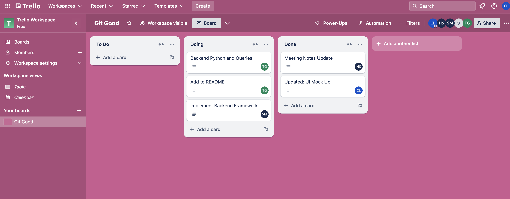

This document describes the weekly updates completed by members of Team 5, Git Good.

## Week 1 - 3
No group yet or no meeting time available during that week, so no updates.

## Week 4
Group meeting for Lab 3 and project ideas.

## Week 5
Group decided on doing an inventory system for project and discussed potential ways to split up tasks/work.
A second meeting this week was a walkthrough by Sterling on how the rest of the group can download the needed software and setup the project on the group's local machines.
- Sterling: set up basic framework for the inventory system

## Week 6
Group discussed Milestone 1 and filled in the answers on the README file
Discussed possible features for the UI: log in screen, add product, search product, home screen to show all products in inventory
- Claire: Work on designing U/I
- Sterling: Finish and update whole layout/infrastructure
- Therese: Create documentation of log in screen/home screen/columns want to display
- Holly: Document meeting notes 

## Week 7 

The group worked on tasks assigned last week and discussed changing roles for this week.
- Therese: Updated the README for the group .... and worked on backend python architecture and queries
- Sterling: Updated backend framework for project base
- Holly: Updated week 5 meeting notes to keep track of what happened during the meeting
- Claire: Updated small details of the UI Mockup per meeting notes from week 5 and created new schema page layout for inventory items.
- Cole: Not responsive to team (email or meeting time)

  ## Week 8
  Claire, Therese, and Holly met with Professor Knox to discuss project and group dynamic this far
  It was decided that we would split our group and rework our project. A secondary meeting took place Sunday where we updated the new README and starte to assign general tasks via utilizing Trello.
  - Claire: Put a few action items into Trello regarding HTML and CSS, and work on these or other action items depending on the other items' priorities.
  - Therese: Put a few action items into Trello regarding the database structure and work on these or other action items.
  - Holly: Put a few action items into Trello regarding HTML and work on these or other action items.
 
   ## Week 9
